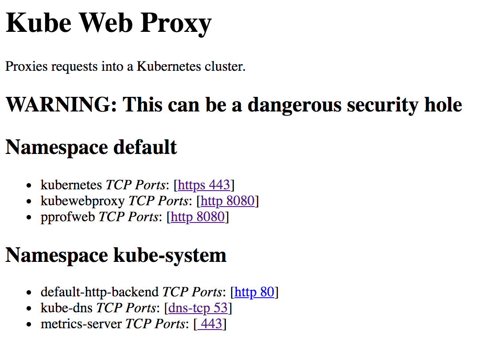

# Kube Web Proxy

This is a hack to make it easy to connect to HTTP debug interfaces inside your Kubernetes cluster. You go to the proxy, and it shows you a list of pods/services in the cluster. You click the port you want, and it connects you. This makes it easy to access internal debugging interfaces. For example, you can access the [Go pprof web UI](https://golang.org/pkg/net/http/pprof/) to collect profiling information. This is a bit like the port-forwarding part of [Octant](https://github.com/vmware-tanzu/octant), but runs in your cluster so it doesn't require installing anything, and it is very, very ugly.

Since this is a potential security hole, Kube Web Proxy requires requests to have been authenticated with the (Google Cloud Identity-Aware Proxy (IAP))[https://cloud.google.com/iap/]. Getting this set up is a bit of a pain. My advice is:

1. Set up the Ingress, without IAP turned on. The `/health` endpoint should work, but the other paths will return forbidden errors.
2. Enable IAP for the Ingress, which may require some fiddling.

## Limitations

The proxy has to rewrite paths, in order to add the namespace/service/port to the URL path. I have only gotten a few toy web applications to work through the proxy, so I'm almost certainly missing some additional rewriting. This also means JavaScript that embeds paths will almost certainly not work. The solution is probably to rewrite the application to use relative paths. A better solution would be to use a wildcard domain, but that is not supported by Google's managed certificates so would require more configuration.

## Useful Documentation
* Managed Certificates on GKE: https://cloud.google.com/kubernetes-engine/docs/how-to/managed-certs
* IAP on GKE: https://cloud.google.com/iap/docs/enabling-kubernetes-howto
* Health checks (huge PITA with IAP verification since we need to move the health check to a non-standard path): https://cloud.google.com/kubernetes-engine/docs/concepts/ingress#health_checks

## Set up / using

1. Build the container image and publish it.
2. Configure IAP for your GKE cluster: https://cloud.google.com/iap/docs/enabling-kubernetes-howto
3. Edit kubewebproxy-service.yaml and set `Image` and `--iapAudience` to the correct values for your cluster.
4. kubectl apply -f kubewebproxy-service.yaml to configure the ingress, service, deployment, service account, GKE managed certificates, IAP, etc. This is unlikely to work without some edits.
5. Access the ingress in your web browser.

## Kubernetes Service Account

This service needs access to the `view` ClusterRole to get access to the Kubernetes API. I followed the in-cluster configuration example to get this to work by granting it a service account with permission to view everything:

https://github.com/kubernetes/client-go/tree/master/examples/in-cluster-client-configuration

## Run Locally

docker build . --tag=kubewebproxy
docker run --rm -ti --publish=127.0.0.1:8080:8080 kubewebproxy

Open http://localhost:8080/

## Building with Google Cloud Build

~/google-cloud-sdk/bin/gcloud builds submit . --project=gosignin-demo --substitutions=_LABEL=debug1
